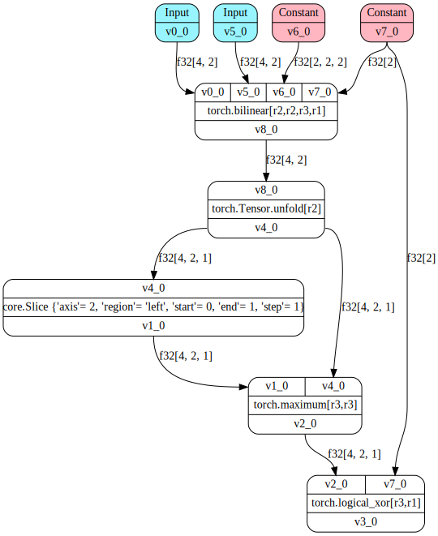

# Fuzzing Deep-Learning Systems via Operator Rule Inference and Hybrid Model Generation

This is an anonymous repository for the paper *"Fuzzing Deep-Learning Systems via Operator Rule Inference and Hybrid Model Generation"* under review for FSE'2023. Please do *not* distribute.

## Setup

*The environment is tested on Ubuntu 20.04 LTS.*

**Step 1: Install Conda** via this [link](https://docs.conda.io/en/latest/miniconda.html).

**Step 2: Setup dependency**

```shell
# Prepare
sudo apt install graphviz-dev
conda create -n dynofuzz python=3.8 -y
conda activate dynofuzz
pip install --upgrade pip

# Install DL framework under test
pip install keras==2.10.0
pip install --pre tf-nightly==2.13.0.dev20221204 --upgrade
pip install --pre torch==2.0.0.dev20221231+cpu --index-url https://download.pytorch.org/whl/nightly/cpu --upgrade
# NOTE: we were using torch==1.14.0.dev20221202+cpu which was yanked from the nightly channel (seems to be security reasons).
# As a result, we use the closest version for approximation.

# Install fuzzing framework
pip install -r requirements/core.txt
pip install -r requirements/dev.txt
pip install -r requirements/exp.txt
```

## Quick Start

```shell
export PYTHONPATH=$(pwd):$(pwd)/autoinf
yes | python3 dynofuzz/cli/model_gen.py model.type=torch backend.type=torchjit debug.viz=true mgen.method=dynofuzz mgen.record_path=data/torch
```

Then you can see a visualized model structure in `dynofuzz_output/graph.png`:

.

## Run Fuzzing

To run fuzzing for 1 minute:

```
export PYTHONPATH=$(pwd):$(pwd)/autoinf
export CUDA_VISIBLE_DEVICES="" # GPU is not needed

# Torch ~ JIT ~ Check bug reports in `fuzz_output/torch-$(date +%m%d)-dynofuzz-n5`
python3 dynofuzz/cli/fuzz.py fuzz.time=60s fuzz.root=fuzz_output/torch-$(date +%m%d)-dynofuzz-n5 \
                                            mgen.record_path=data/torch \
                                            model.type=torch backend.type=torchjit filter.type="[nan,dup,inf]" \
                                            debug.viz=true hydra.verbose=fuzz \
                                            mgen.method=dynofuzz

# TensorFlow ~ XLA ~ Check bug reports in `fuzz_output/tf-$(date +%m%d)-dynofuzz-n5`
python3 dynofuzz/cli/fuzz.py fuzz.time=60s fuzz.root=fuzz_output/tf-$(date +%m%d)-dynofuzz-n5 \
                                            mgen.record_path=data/tf \
                                            model.type=tensorflow backend.type=xla filter.type="[nan,dup,inf]" \
                                            debug.viz=true hydra.verbose=fuzz \
                                            mgen.method=dynofuzz
```


## Troubleshooting

Email `dynofuzz@proton.me` anonymously for any technical questions. Issue panel is currently disabled to prevent the exposure of identity.
